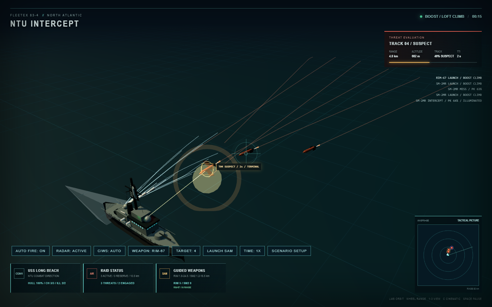

<div align="center">

# NTU Intercept

**浏览器三维单舰防空与舰对舰导弹交战沙盘**

[](README.md)
[](README_EN.md)

</div>

> [!IMPORTANT]
> 项目使用真实舰船、雷达和武器名称建立时代背景，但全部性能数值均为游戏化缩放。它不是武器性能数据库、工程分析工具或训练系统，也不代表真实装备能力。



<a id="目录"></a>
## 目录

- [1. 当前项目](#当前项目)
- [2. 快速开始](#快速开始)
- [3. 第一场战斗](#第一场战斗)
- [4. 操作与场景配置](#操作与场景配置)
- [5. 舰船、平台与武器目录](#目录数据)
- [6. 固定步长仿真与 OODA](#仿真循环)
- [7. 传感器、ESM 与航迹](#传感器航迹)
- [8. 防空交战链](#防空交战)
- [9. 发射器与火力资源](#发射系统)
- [10. 反舰交战链](#反舰交战)
- [11. 电子战、诱饵与近防](#电子战近防)
- [12. 机动、毁伤与任务结算](#机动毁伤)
- [13. 三维表现与 AAR](#三维与aar)
- [14. 单位、缩尺与确定性](#单位确定性)
- [15. 当前代码架构](#代码架构)
- [16. 扩展指南](#扩展指南)
- [17. 构建与浏览器验证](#开发验证)
- [18. 已知边界](#已知边界)
- [19. 许可与安全](#许可安全)

<a id="当前项目"></a>
## 1. 当前项目

NTU Intercept 是一个基于 Three.js、TypeScript 和 Vite 的单页三维战斗沙盘。当前可选择：

- USS Long Beach (CGN-9)，NTU 时期核动力导弹巡洋舰，使用 Mk 10 双臂发射架。
- USS Lake Champlain (CG-57)，Ticonderoga 级 AEGIS 巡洋舰，使用 Mk 41 VLS。
- Slava 级 Moskva，当前唯一的目录化敌方水面平台，可发射 P-500 并接受完整毁伤。
- P-15 Termit、P-500、P-700、Kh-22 和 RGM-84 Harpoon 五种目录化来袭武器。
- RIM-67、SM-2MR 和 SM-2ER 三种舰空导弹。

项目同时覆盖两类战斗：

```text
空中/反舰弹突防：搜索 -> 航迹 -> 火控 -> SAM -> ECM/诱饵 -> CIWS -> 命中/漏防

舰对舰交战：ESM 提示 -> 接近 -> 水面雷达航迹 -> 火控 -> 齐射规划
            -> 中段数据链 -> 主动末制导 -> 软/硬杀伤 -> 穿透与内部爆炸 -> BDA
```

当前是单舰对单平台沙盘，不包含舰队级 CEC、航空兵、潜艇、多人联网或战役存档。舰船、导弹和设备模型均由代码程序化生成，不依赖外部 3D 模型文件。

`README.md` 是当前实现的主要说明；`README_EN.md` 是辅助英文文档，更新可能滞后，应以源码和本文件为准。

<a id="快速开始"></a>
## 2. 快速开始

环境要求：

- Node.js 20.19+ 或 22.12+
- npm
- 支持 WebGL 2 的现代浏览器

安装并启动：

```bash
npm install
npm run dev
```

Vite 默认地址通常为：

```text
http://127.0.0.1:5173/
```

生产构建：

```bash
npm run build
```

构建依次执行 TypeScript 类型检查和 Vite 打包，产物写入 `dist/`。

<a id="第一场战斗"></a>
## 3. 第一场战斗

页面首先打开场景面板。默认防御舰为 USS Long Beach，攻击来源为 Moskva，真实初始舰间距离为 65 km。

1. 保持默认配置并选择 `START EXERCISE`。
2. 初始阶段通常只有 ESM 方位提示；提示稳定且误差落入平台定义的被动目标指示门槛后，可形成搜索区发射解算，但这不是精确雷达火控。
3. 双方 OODA 会依据带误差的被动航迹选择接近。
4. 进入有机雷达地平线后会逐步建立精确航迹；在此之前，双方也可能依据合格 ESM 被动目标指示发射 P-500 或 Harpoon，导弹中段仍会尝试更新航迹，末段必须由主动导引头捕获。
5. 使用 `TIME` 切换到 2X 或 4X 可加快超视距接近阶段。
6. 使用数字键 `5` 查看敌平台近景，数字键 `2` 返回默认战术视角。

默认 65 km 是平台定义中的战术距离，不是敌舰的绝对 Z 坐标。场景面板使用世界坐标，`10` 个世界单位等于 `1 km`；默认己方 `Z=40`、敌方 `Z=-610`，实际间隔正好为 65 km。这个距离通常仍在有机水面雷达地平线之外，因此开局交战可能先显示 `PASSIVE CUE` / `SEARCH BASKET`，而不是立即显示 `FC READY`。

<a id="操作与场景配置"></a>
## 4. 操作与场景配置

### 战斗控制

| 控件 | 当前行为 |
|---|---|
| `AUTO FIRE` | 自动规划舰空导弹射击；关闭后仍可人工请求发射 |
| `DOCTRINE` | 在 `SINGLE`、`DOUBLE`、`SS-L-S` 之间切换 |
| `RADAR` | 己方主动雷达辐射或 EMCON 静默 |
| `OPFOR RADAR` | 敌平台雷达辐射或静默；不直接关闭其 ECM |
| `SEARCH` | 在 360°、120°、60° 搜索扇区间切换 |
| `SLEW` | 将聚焦搜索中心指向当前目标 |
| `CIWS` | 己方近防系统自动或保持 |
| `THREAT CHAFF` | 来袭武器是否释放自身箔条 |
| `OPFOR ECM` | 威胁侧干扰，以及敌平台对 Harpoon 的持续干扰 |
| `OPFOR DECOYS` | 敌平台有限库存诱饵自动释放或保持 |
| `SHIP ECM` | 己方 AN/SLQ-32 自动或保持 |
| `SRBOC` | 己方 Mk 36 SRBOC 自动或保持 |
| `SURFACE STRIKE` | Harpoon 自动攻击规划或保持 |
| `LAUNCH HARPOON` | 请求一次人工反舰齐射，仍受航迹和火控门控 |
| `WEAPON` | 循环选择本舰兼容的舰空导弹 |
| `TARGET` | 循环选择仍然有效的来袭目标 |
| `LAUNCH SAM` | 对当前目标提交人工舰空导弹请求 |
| `TIME` | 在 1X、2X、4X 仿真速度间循环 |
| `SCENARIO SETUP` | 暂停并重新打开场景配置 |

人工发射不会绕过射程、弹药、航迹、3D 高度、火控质量、航迹新鲜度、通道和发射器状态。

### 镜头与快捷键

| 输入 | 行为 |
|---|---|
| 鼠标拖动 | 环绕当前焦点 |
| 鼠标滚轮 | 调整镜头距离 |
| `1` | 防御舰近景 |
| `2` | 默认战术视角 |
| `3` | 防御舰与目标之间的宽景 |
| `4` | 跟随在飞拦截弹，或当前来袭弹 |
| `5` | 敌方水面平台近景 |
| `C` | 电影式自动环绕 |
| `Space` | 暂停或继续 |
| `R` | 重新加载页面 |

### 场景面板

面板可配置：

- 防御舰、攻击来源和兼容导弹类型。
- 首波数量、发射间隔、初始高度、中心坐标和编队宽度。
- 防御舰坐标，以及在战术雷达上点选双方位置。
- RIM-67、SM-2MR、SM-2ER、Harpoon 和 CIWS 请求库存；Mk 41 请求总数超过实体单元数时会按比例压缩到可用单元。
- SAM 通道、末段照射器、第二波类型/数量/延迟。
- 前后发射器以及敌平台近防、反舰发射器、火控、ECM、诱饵和损管健康度。
- `P-15 RAID`、`SEA SKIMMER`、`SATURATION`、`HIGH SPEED`、`HARPOON RAID` 快速预设。

重新开始会清除上一局航迹、AAR、在飞武器、发射请求、爆炸和损伤，并按所选舰型重新构造发射器与库存。

<a id="目录数据"></a>
## 5. 舰船、平台与武器目录

### 防御舰

| 舰船 | 时代/角色 | 主雷达 | 发射系统 | 默认 SAM 库存 | Harpoon |
|---|---|---|---|---|---:|
| USS Long Beach (CGN-9) | NTU 1980s / 核动力导弹巡洋舰 | AN/SPS-48E + AN/SPS-49 | 2 座 Mk 10 | RIM-67 6、SM-2MR 12、SM-2ER 8 | 8 |
| USS Lake Champlain (CG-57) | 1990s AEGIS 防空巡洋舰 | AN/SPY-1B + AN/SPS-49 | 前后 Mk 41，64 个游戏化单元 | 实际默认装填：SM-2MR 39、SM-2ER 25 | 8 |

CG-57 元数据中的场景请求默认值为 SM-2MR 48、SM-2ER 32；由于合计超过 64 个实体单元，`allocateVlsLoadout()` 在开局按请求比例分配为 39 枚与 25 枚。用户修改场景库存时也遵循同一容量约束。

舰型配置还声明航速、加减速、转弯率、雷达截面、显著高度、防区距离、子系统名称/位置和命中区段。`main.ts` 不按舰名选择这些值。

### 敌方水面平台

当前 `slava-moskva` 定义包含：

- 65 km 默认场景距离。
- MR-800 `TOP PAIR`、MR-700 `TOP STEER` 和 `ARGUMENT / FRONT DOOR` 三类传感器槽。
- 16 个实体 P-500 Bazalt 倾斜发射硬点。
- 6 座注册到模型的 AK-630 点防御炮位。
- 两条游戏化点防御通道、6 个有效射击批次和最多每目标两次再交战。
- 8 组游戏化诱饵，以及独立的电子战、诱饵、火控、发射器、推进和损管健康状态。
- BOW、FORWARD、AMIDSHIPS、AFT 分区毁伤和持续火灾/进水。

### 来袭武器

以下数值直接来自 `src/threats/`，高度换算为米，距离换算为公里：

| 型号 | 巡航高度 | 末段高度 | 巡航/末段速度 | 末段开始 | 伤害 | 主要能力 |
|---|---:|---:|---:|---:|---:|---|
| P-15 Termit | 97.5 m | 12.5 m | 6.2 / 6.4 u/s | 24 km | 32 | 末段前保持较高低空，最后 5.4 km 独立降高 |
| P-500 | 60 m | 15 m | 8.8 / 9.6 u/s | 18 km | 28 | 掠海、50° 主动导引头、末段机动 |
| P-700 | 130 m | 20 m | 9.8 / 10.8 u/s | 22 km | 38 | 更高威胁优先级和更强摆动 |
| Kh-22 | 18,000 m | 110 m | 13.2 / 15.2 u/s | 45 km | 46 | 高空高速俯冲，CIWS 单次 PK 上限 14% |
| RGM-84 Harpoon | 45 m | 6 m | 5.8 / 6.4 u/s | 13 km | 20 | 主动末制导、掠海/跃升、HOJ、目标丢失惯性续航 |

`RGM-84 Harpoon` 同时可作为空中来袭预设和己方实体 Mk 141 反舰武器。舰对舰 Harpoon 使用舰型 `surfaceStrike` 参数，目标侧终端包线来自统一威胁定义。

<a id="仿真循环"></a>
## 6. 固定步长仿真与 OODA

逻辑使用固定 `0.05 s` 步长。渲染帧率不改变动力学、传感器刷新或发射器机械周期；2X/4X 只改变单位真实时间累计的仿真步数。

每个固定步长的主要顺序为：

```text
敌平台传感器、机动与渐进毁伤
-> 防御舰雷达、表面航迹、机动、发射器、照射器、SAM、CIWS 和 Harpoon
-> 来袭导弹中段/末段制导、ECM、诱饵与命中
-> 敌平台波次评估与后续火力计划
-> AAR 状态快照
```

顺序很重要：平台持续毁伤会在当步火力规划之前生效；被摧毁或关键系统失能的平台不会在同一帧继续获得新的合法发射计划。已经离筒的武器不会因为发射平台随后失能而被删除。

己方和敌方分别按舰型/平台定义的决策周期执行 OODA。机动只读取本方可观察航迹，不直接读取目标真值：

- 无有效接触时巡逻。
- 只有 ESM 低质提示时向有机雷达地平线接近。
- 有稳定水面航迹时围绕配置的防区距离执行接近、保持或撤离。
- 有合格近距来袭弹时，防御性 beam 机动抢占普通水面机动。
- 推进损伤、舰体状态和最大航速共同限制实际运动。

<a id="传感器航迹"></a>
## 7. 传感器、ESM 与航迹

### 防御舰雷达

| 雷达 | 扫描 | 维度 | 基础刷新 | 游戏最大距离 |
|---|---|---|---:|---:|
| AN/SPS-48E | 机械 | 3D | 0.75 s | 65 km |
| AN/SPS-49（CGN-9） | 机械 | 2D | 1.15 s | 105 km |
| AN/SPY-1B | 相控阵 | 3D | 0.42 s | 82 km |
| AN/SPS-49（CG-57） | 机械 | 2D | 1.05 s | 110 km |

机械扫描在聚焦扇区外不会同步刷新；AN/SPY-1B 对聚焦扇区快速刷新，同时以较慢周期维护 360° 背景搜索。CG-57 的四个固定阵面具有独立健康度和方位损伤。

### 探测与航迹

有效探测距离按目标 RCS 四次方根、传感器健康度和阵面方位健康度缩放。通过距离门限后仍要计算：

- 雷达与目标显著高度形成的 4/3 地球半径雷达地平线。
- 距离比、扫描模式、扇区聚焦和目标高度。
- 确定性概率探测，不保证“进圈即发现”。
- 带位置、高度和速度误差的测量。
- 航迹关联门、分类、质量、不确定度和陈旧时间。

2D 航迹可以预警，但不能单独满足 SAM 发射所需的高度解算。新鲜 3D 测量会累积 `solutionQuality`；达到 `0.45` 后才形成舰空火控解算。航迹超过 2.2 秒会被 SAM 发射逻辑视为陈旧，高度数据约 4 秒未更新后失效。

### 水面 ESM 与雷达地平线

敌方雷达辐射时，双方电子支援系统可生成质量约 `0.12-0.20`、距离误差很大的被动方位航迹。默认平台把 ESM 仅用于 OODA 接近；舰型/平台若声明 `passiveTargeting`，则在更严格的不确定度、稳定时间和质量门槛满足后允许搜索区发射。ESM 不能当作精确雷达真值，也不能跳过末段主动搜索器捕获。

默认 65 km 水面场景因此先显示 `ESM CUE` 和 `CLOSE`。双方进入有机雷达地平线、形成合格直接测量后，状态才依次进入 `TRACK BUILD -> FC BUILD -> FC READY -> LAUNCHED`。水面卡显示的是观测距离与质量，不是后台真值。

<a id="防空交战"></a>
## 8. 防空交战链

### 舰空导弹包线

| 武器 | 最小/最大射程 | 最大速度 | 助推时间 | 转弯率 | 末段范围 | 当前舰型 |
|---|---:|---:|---:|---:|---:|---|
| RIM-67 | 2.0 / 75 km | 12.5 u/s | 5.2 s | 18°/s | 18 km | CGN-9 |
| SM-2MR | 1.5 / 45 km | 13.5 u/s | 4.4 s | 22°/s | 10 km | CGN-9、CG-57 |
| SM-2ER | 2.2 / 90 km | 14.2 u/s | 6.2 s | 16°/s | 19 km | CGN-9、CG-57 |

这些是游戏包线，不是现实公开性能表。

### 发射前门控

一次合法 SAM 发射需要：

1. 仿真正在运行，发射器完成循环。
2. 武器与当前舰型发射器兼容且库存非零。
3. 目标仍有效，存在新鲜航迹和 3D 高度。
4. `solutionQuality >= 0.45`。
5. 目标位于武器最小/最大射程内。
6. SAM 通道、条令射击数和物理发射器均允许继续分配。

### 两阶段制导

中段导引读取带延迟和误差的舰载航迹更新，而不是目标真值。失去新鲜数据时沿最后指令点惯性飞行。

- 项目中的 RIM-67 在游戏化末段范围内开启主动导引头，经历预热、视场搜索、捕获、置信度建立、跟踪和短时记忆。捕获概率考虑距离、离轴角、交接误差、目标 RCS、邻近竞争目标和海杂波；超出吊架角或视线角速度会失锁。
- SM-2MR/ER 在末段需要舰载照射。照射器按实体数量、方向和火控健康度分配；连续失照超过 2.5 秒后判定脱靶。

拦截弹具有三维速度、有限加速度、助推器分离、转弯率、阻力/能量损失和最近接距离。海掠目标使用低空前向拦截走廊，高空目标允许能量型爬升。只有进入 2.5 世界单位的近炸解算区才进行单发 PK 判定；飞越目标、吊架未捕获、失照或射程耗尽都有独立脱靶原因。

### 命中概率与效率验证

命中 PK 综合航迹/导引质量、局部饱和、照射、交会几何和剩余能量，并限制在 `0.08-0.88`。概率事件使用 `src/probability.ts` 的确定性均匀哈希骰；不再使用会偏向 1 的 `abs(sin(seed))`，也不依赖无关的弹药余量。

`npm run verify:sam-efficiency` 在真实浏览器中串行运行 3 种 SAM 对 4 种目标的矩阵。脚本使用进程互斥锁和 Chromium 渲染进程上限，禁止并发矩阵压测。门槛按已结算射击 `kills / (kills + misses)` 计算；战局结束时仍在飞、因目标已毁而取消的拦截弹不会被错误计入单发 PK 分母。

| 武器 | P-15 | P-500 | P-700 | Kh-22 |
|---|---:|---:|---:|---:|
| RIM-67 最低门槛 | 40% | 45% | 35% | 30% |
| SM-2MR 最低门槛 | 40% | 50% | 50% | 35% |
| SM-2ER 最低门槛 | 35% | 50% | 40% | 45% |

这些是回归下限，不是现实武器 PK，也不是承诺每场战斗都达到相同结果。

<a id="发射系统"></a>
## 9. 发射器与火力资源

### Mk 10

CGN-9 的前后 Mk 10 分别维护：待命、转向、发射、回位和装填状态。请求先分配健康且空闲的发射架；模型按目标方位转向和抬臂，武器从当前导轨世界坐标离架。导轨发射后显示空位，并在装填周期后恢复下一枚实体弹。

发射器损伤会降低可用性；前后架可独立失效。后发射架位置、回转和舰桥间隙由模型挂点决定，不在战斗主循环写死。

### Mk 41

CG-57 使用数据驱动的 64 单元网格。每个单元包含装填型号、前/后甲板区、舱盖、开盖、发射、关盖、耗尽或禁用状态。

序列器实现：

- SM-2MR/ER 按确定性装填排列分配到具体单元。
- 前后 VLS 区轮换，优先选择远离上一发排焰区的可用单元。
- 相邻单元受排焰净空和最小发射间隔限制。
- 发射器损伤从局部中心向相邻单元扩散，并产生被隔离、困住的弹药。
- 模型舱盖动画、烟焰、离舰方向和单元状态与逻辑一致。

SAM 通道限制在途/待发交战数；SM-2 末段还额外占用照射器。弹药很多并不等于可以同时向所有目标发射。

<a id="反舰交战"></a>
## 10. 反舰交战链

### Harpoon 火力规划

CGN-9 和 CG-57 都从模型注册的 8 个 Mk 141 硬点发射 Harpoon。规划器要求稳定且新鲜的水面雷达航迹，并依据：

- 目标耐久估计与单发毁伤。
- 先验漏防率和已经解析的命中/拦截报告。
- 最小齐射、每波上限和最大在途武器数。
- BDA 等待时间，以及上一波尚未解析的数量。

两舰的火控延迟、数据链周期、航路偏置和速度补偿来自各自 `surfaceStrike` 配置。人工 `LAUNCH HARPOON` 服从同一门控，不能绕过航迹或在途上限。

`surfaceStrike.passiveTargeting` 可为远距 ESM 搜索区发射声明独立的质量、稳定时间、火控延迟和最大位置不确定度门槛；未声明该能力的平台仍必须等待直接雷达航迹。

Harpoon 从实体 Mk 141 轴线离架，依次经历：

```text
BOOST -> DATALINK MIDCOURSE -> INERTIAL COAST（失链时）
-> ACTIVE SEARCH -> TARGET ACQUIRED -> TERMINAL AUTONOMOUS
-> SKIM 或 POP-UP -> PENETRATION -> 延时内部爆炸
```

中段使用带误差的位置/速度报告并在刷新间隔内外推。主动导引头开启不等于自动捕获；真实目标仍须进入捕获距离和 50° 视场。丢失目标后只能在有限时间内沿最后解算续航。

### Moskva P-500 波次

Moskva 的攻击数量是授权上限，不是开局一次性生成。火力计划根据 `salvoDoctrine` 提交首波，等待武器解析和 BDA，再决定是否补射。平台损伤会先改变传感器、发射器和火控能力，然后才允许下一次规划。

每枚 P-500 绑定一个实体 Bazalt 硬点和端盖，经历 `TUBE EXIT -> BOOST -> PROGRAM TURN -> MIDCOURSE TAKEOVER`。平台数据链中断后沿最后指令惯性飞行；进入末段搜索区并满足视场后才转入自主制导。同一波武器围绕共同计划到达窗进行有限速度补偿，不能瞬移或无限调整速度。

尚未离筒的预约在平台失能、发射器失效、火控长期丢失或目标已失能时转为 `canceled`；已经离筒的武器继续飞行并保留在 AAR 中。

<a id="电子战近防"></a>
## 11. 电子战、诱饵与近防

### 舰载 ECM

ECM 是舰上电子战天线的电磁辐射，不是发射物。模拟使用游戏化的干扰强度、距离衰减、烧穿距离和目标/诱饵竞争关系：

- `SHIP ECM` 作用于来袭导弹末段瞄准点。
- `OPFOR ECM` 作用于 SM-2，并作为 Moskva 对 Harpoon 的持续干扰源。
- Harpoon 支持简化 HOJ；强干扰可能暴露辐射源方向，但不会保证命中。
- 进入型号配置的烧穿区后，干扰偏差快速下降。

ECM、诱饵和雷达是独立系统。关闭敌方雷达不会自动关闭 ECM，关闭 ECM 也不会删除已经释放的诱饵。

### 箔条与诱饵

- 来袭武器可按 `THREAT CHAFF` 释放自身箔条，SM-2 可能捕获竞争回波。
- 己方 Mk 36 SRBOC 具有有限库存、飞行和爆开过程，形成随风漂移并衰减的诱饵云。
- Moskva 诱饵只有在合格来袭航迹进入部署区后才释放；发射方向来自航迹估计而非 Harpoon 真值。
- Harpoon 软杀伤比较舰体、诱饵和干扰功率，可记录 `DECOY`、`ECM`、`ECM + DECOY`、`HOJ` 或 `BURN THROUGH`。

### CIWS 与平台点防御

己方 CIWS 只攻击进入近距窗口的末段目标。炮位需先转向，单次 PK 受目标类型、局部饱和、剩余射击窗口、系统健康度和弹药影响；Kh-22 具有更低上限。

Moskva 点防御不会读取 Harpoon 真值。每枚 Harpoon 先形成独立来袭航迹，再经历探测、质量门槛、火控反应、通道分配、炮位转向和效应器飞行时间。第一发脱靶后仍需等待观察与重新解算，才能进行第二次交战。

<a id="机动毁伤"></a>
## 12. 机动、毁伤与任务结算

### 防御舰毁伤

来袭导弹命中先根据相对舰体坐标选择纵向区段，再在该区段声明的系统中分配主/次损伤。系统健康度会实际改变战斗：

| 子系统 | 主要后果 |
|---|---|
| 主雷达/固定阵面 | 探测距离、刷新、测量质量和方位覆盖下降 |
| 二维搜索雷达 | 远程预警质量和刷新下降 |
| 火控 | 3D 解算、照射器数量/稳定性和发射延迟恶化 |
| 前/后发射器 | Mk 10 不可用，或 Mk 41 局部单元隔离 |
| CIWS | 转向、射击效果和可用性下降 |
| ECM/SRBOC | 干扰强度、诱饵库存或释放能力下降 |
| 推进 | 最大航速、加速和转弯能力下降 |

### 敌平台毁伤

Harpoon 不使用舰体中心球形命中。弹体位置转换到 Moskva 局部坐标，与按模型长宽生成且舰艏/舰艉收窄的轮廓相交。首次接触进入穿透阶段，延时引信到期后才内部爆炸。

内部爆炸按 BOW/FORWARD/AMIDSHIPS/AFT 分区伤害平台子系统，并生成持续火灾和进水。损管按固定周期降低或放大灾情；渐进毁伤可以在没有新命中的情况下继续扣除舰体并最终使平台失能。

任务结算等待来袭弹、Harpoon、平台波次、SAM 和物理发射器状态全部解析。AAR 区分硬杀伤、软杀伤、漏防、表面命中、渐进毁伤和目标最终状态。

<a id="三维与aar"></a>
## 13. 三维表现与 AAR

### 程序化模型

- CGN-9 包含折线舰体、前后 Mk 10、AN/SPS-48E、AN/SPS-49、AN/SPG-55、Mk 141、CIWS、灯光、烟囱烟和分级细节组。
- CG-57 使用按真实长宽比校正的舰体、前后 Mk 41、Mk 45、AN/SPY-1B 四阵面、AN/SPG-62、Mk 141、CIWS、灯光和 LOD 组。
- Moskva 包含 Slava 级舰体、16 个 Bazalt 发射筒、雷达/火控锚点、AK-630 炮位、端盖和毁伤效果。
- 五种威胁拥有独立轮廓、尾焰、掠海雾迹、导引头锥和姿态动画。

LOD 根据镜头距离切换高、中、低细节。雷达旋转、搜索波束、导航灯、尾焰、助推器分离、发射烟气、海面尾迹、火灾和烟柱均由运行时更新。

战术距离与模型显示使用不同缩尺。舰船被有意放大以便在 4X 风格视图中识别，不能通过画面中的“几个舰长”推断公里数；HUD 航迹距离和 `data-surface-range-km` 才是仿真距离。默认 Moskva 场景已由浏览器验证为真实 65 km。

### AAR

AAR 保存时间线和固定间隔快照，重放内容包括：

- 防御舰位置、航向与舰体状态。
- 来袭弹、SAM、Harpoon、诱饵和敌平台位置/状态。
- 传感器、发射、制导、电子战、机动、命中和系统事件。
- SAM 发射、硬/软杀伤、漏防、表面命中、渐进毁伤和目标耐久摘要。

AAR 是战局回放，不是完整的工程遥测导出。

<a id="单位确定性"></a>
## 14. 单位、缩尺与确定性

- 水平距离：`10 世界单位 = 1 km`。
- 来袭弹高度：`1 世界单位 = 50 m`。
- 舰船模型和武器模型使用独立视觉缩尺，不能与战术距离直接比较。
- 舰速从节换算为游戏世界速度；导弹速度和加速度是游戏单位。
- 雷达、射程、烧穿距离、伤害和 PK 都是平衡参数。

传感器和战斗概率使用可复现的确定性序列。通用概率事件使用均匀哈希骰；相同配置通常得到相同结果。浮点时间、浏览器调度和不同交战顺序仍可能改变事件键，因此项目保证“可回归”，不承诺跨所有运行环境逐位一致。

<a id="代码架构"></a>
## 15. 当前代码架构

```text
game-codewar-intercept/
├─ index.html
├─ package.json
├─ LICENSE
├─ README.md
├─ scripts/
│  ├─ measure-sam-efficiency.mjs
│  ├─ verify-cg57.mjs
│  ├─ verify-surface-distance.mjs
│  ├─ verify-surface-salvo.mjs
│  ├─ verify-bilateral-launch.mjs
│  └─ verify-platform-*.mjs
└─ src/
   ├─ main.ts                    # UI、场景编排、固定步长循环和跨系统协调
   ├─ combat-types.ts            # 空中交战与 AAR 运行时类型
   ├─ ship-types.ts              # 防御舰能力合同
   ├─ ship-catalog.ts            # 防御舰目录
   ├─ interceptor-data.ts        # SAM 包线
   ├─ probability.ts             # 确定性均匀概率骰
   ├─ sim.ts                     # 雷达、航迹、地平线和火控质量
   ├─ sensor-faces.ts            # 固定阵面方位健康度
   ├─ vls.ts                     # Mk 41 装填、排序、间隔和损伤隔离
   ├─ surface-combat.ts          # Harpoon 飞行、软硬杀伤和平台命中
   ├─ surface-doctrine.ts        # 反舰齐射规模与 BDA 规划
   ├─ models/
   │  ├─ long-beach.ts
   │  ├─ ticonderoga.ts
   │  ├─ hull-geometry.ts
   │  ├─ model-primitives.ts
   │  └─ us-navy-equipment.ts
   ├─ threats/
   │  ├─ catalog.ts / types.ts
   │  ├─ p15.ts / p500.ts / p700.ts / kh22.ts / harpoon.ts
   │  └─ model-helpers.ts
   ├─ platforms/
   │  ├─ catalog.ts / types.ts / runtime.ts
   │  ├─ defense.ts / visual-defense.ts / model-slots.ts
   │  └─ models/moskva.ts
   └─ visual/
      ├─ ocean.ts
      ├─ threat-particles.ts
      └─ material-textures.ts
```

### 模块边界

- `main.ts` 负责把通用能力组合成一局战斗，不应包含舰名或平台 ID 特判。
- 防御舰的能力、库存、传感器、发射器和损伤区段由 `ShipDefinition` 声明。
- 来袭弹包线、终端能力、预设和程序化模型由 `ThreatDefinition` 声明。
- 敌平台传感器、武器槽、机动、点防御、软杀伤和损管由 `EnemyPlatformDefinition` 声明。
- 敌平台武器槽可通过 `passiveTargeting` 声明 ESM 被动目标指示门槛；该门控只授权搜索区发射，不把被动方位误差当作精确火控。
- 模型通过标准挂点注册实体发射位置、传感器锚点和炮口；战斗代码消费挂点，不复制几何坐标。
- Harpoon 运行时与齐射规划分别位于 `surface-combat.ts` 和 `surface-doctrine.ts`。
- 共享物理/概率逻辑应进入独立模块，而不是继续扩大 `main.ts`。

<a id="扩展指南"></a>
## 16. 扩展指南

### 新增防御舰

1. 在 `src/models/` 创建程序化模型，注册雷达、照射器、发射器、CIWS、Mk 141 和 LOD 挂点。
2. 声明 `ShipDefinition`：平台运动、传感器、发射器、库存、子系统和损伤区段。
3. 在 `src/ship-catalog.ts` 注册。
4. 不要在 `main.ts` 添加 `if (ship.id === ...)`。

### 新增来袭武器

1. 在 `src/threats/` 新建型号文件。
2. 将包线、RCS、末段模式、EW 能力、预设和模型集中到一个 `ThreatDefinition`。
3. 在 `src/threats/catalog.ts` 注册一次。
4. 若需要新行为，先扩展通用能力合同，避免在主循环按型号分支。

### 新增敌方平台

1. 在 `src/platforms/models/` 构造模型并注册传感器、武器和点防御挂点。
2. 声明 `EnemyPlatformDefinition`，包括 `defaultScenarioRange`、机动、传感器槽、武器槽、点防御、软杀伤和损管。
3. 确保定义容量与实体硬点数量一致，所有传感器锚点存在。
4. 在 `src/platforms/catalog.ts` 注册；不要在 `main.ts` 判断平台 ID。

### 调整概率或效率

- 先区分未进入近炸区、照射丢失、导引头未捕获、CPA 飞越、射程耗尽和已进入 PK 判定后的普通脱靶。
- 不要只抬基础 PK 掩盖制导、弹道、火控或通道问题。
- 概率骰必须使用 `deterministicProbabilityRoll` 或经过验证的等价实现。
- 修改 SAM 逻辑后运行单场诊断和串行效率矩阵；不要并发启动多个矩阵进程。

<a id="开发验证"></a>
## 17. 构建与浏览器验证

所有浏览器脚本要求开发服务器已经运行。默认读取 `http://127.0.0.1:5173/`，可用 `APP_URL` 覆盖。

| 命令 | 覆盖范围 |
|---|---|
| `npm run build` | TypeScript 类型检查与生产构建 |
| `npm run verify:cg57` | CG-57 舰体比例、设备位置、LOD 和截图 |
| `npm run verify:surface-distance` | 默认配置距离与真实三维舰间距离均为 65 km |
| `npm run verify:surface-salvo` | Harpoon 双侧航路、到达窗、近/远距火控约束 |
| `npm run verify:bilateral-launch` | CGN-9、CG-57 与 Moskva 双向实体发射 |
| `npm run verify:default-platform` | 默认平台、航迹、火控和 P-500 离舰 |
| `npm run verify:default-engagement` | 默认 65 km 双舰场景的 ESM 被动目标指示、双方齐射和实体离舰 |
| `npm run verify:platform-doctrine` | 首波、BDA、补射和命中信用 |
| `npm run verify:platform-arrival` | P-500 同波到达计划与速度补偿 |
| `npm run verify:platform-abort` | 平台/目标失能后的预约取消与在飞武器保留 |
| `npm run verify:platform-defense-visual` | AK-630 挂点、炮口、通道和近防截图 |
| `npm run verify:platform-launcher-damage` | 发射器完全失效后的火力禁止 |
| `npm run verify:platform-launcher-degraded` | 发射器降级、波次承诺与实体硬点一致性 |
| `npm run verify:platform-fire-control-damage` | 火控完全失效后的探测/发射分离 |
| `npm run verify:platform-fire-control-degraded` | 火控降级造成的延迟和质量变化 |
| `npm run verify:sam-efficiency` | 3 x 4 SAM 效率矩阵与最低门槛 |

推荐提交前至少执行：

```bash
npm run build
git diff --check
```

涉及具体机制时运行对应脚本。涉及视觉、模型、动画或布局时必须查看脚本生成的截图，不能只依赖 DOM 数值。

`verify:sam-efficiency` 是耗时测试，只能串行运行。脚本已包含临时目录互斥锁、单浏览器流程和渲染进程上限；不要通过多个终端绕过保护。

<a id="已知边界"></a>
## 18. 已知边界

- 当前每局只有一艘防御舰和最多一个目录化敌方水面平台。
- 没有舰队 CEC、预警机、航空兵、潜艇、数据链网络拥塞或多人联网。
- 雷达地平线、RCS、ECM、诱饵和导引头是可解释的游戏关系，不是射频工程仿真。
- 导弹采用三维点质量近似，不是连续六自由度刚体/气动模型。
- 舰船模型强调可识别轮廓与设备位置，不是测绘级数字孪生。
- 战术距离与模型视觉缩尺不同；远距舰船仍需借助 HUD、雷达和观察镜头理解。
- 海面由 CPU 更新网格实现，不包含完整频谱 FFT、海况或气象传播。
- AAR 没有外部结构化数据导出、存档或跨局统计。
- `main.ts` 仍承担较多跨系统编排；后续应继续把 UI、空中交战运行时和 AAR 拆成独立模块。
- 浏览器脚本是机制回归场景，不是完整单元/集成测试套件。

合理的后续方向包括多舰编队、CEC 网络税、外部目标指示、更多目录化平台、任务存档、结构化 AAR 导出和进一步拆分主循环。

<a id="许可安全"></a>
## 19. 许可与安全

项目采用 [PolyForm Noncommercial License 1.0.0](LICENSE)，版权归 `Sekai6` 所有。允许许可证范围内的非商业运行、研究、修改和分发；未经单独书面授权，不允许商业使用或预期用于商业应用。

由于包含非商业限制，本项目属于 source-available 非商业软件，不是 OSI 定义下的开源软件。

不要提交 API 密钥、访问令牌或其他凭据。`KEYS/` 仅用于本地凭据并应保持在版本控制之外。真实军舰和武器名称仅用于历史题材与游戏辨识，所有实现参数都应继续明确标记为游戏化数据。

---

<div align="center">

[返回目录](#目录) · [English Documentation](README_EN.md)

</div>
