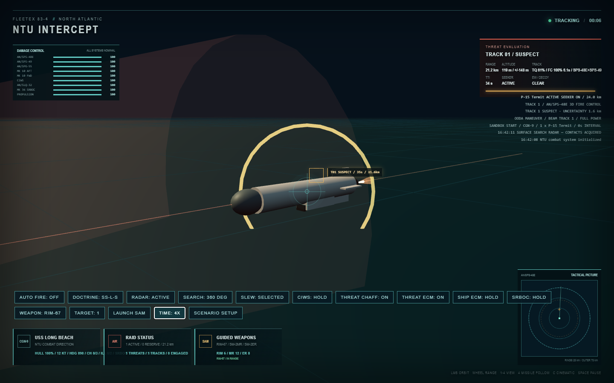
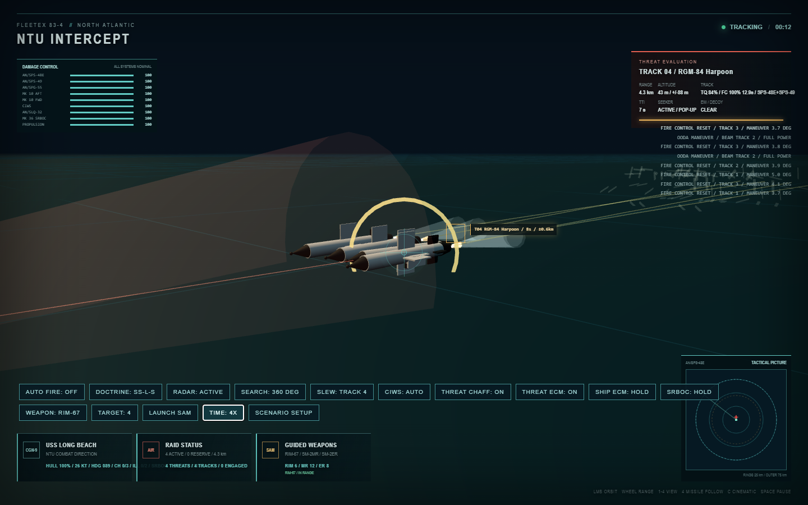
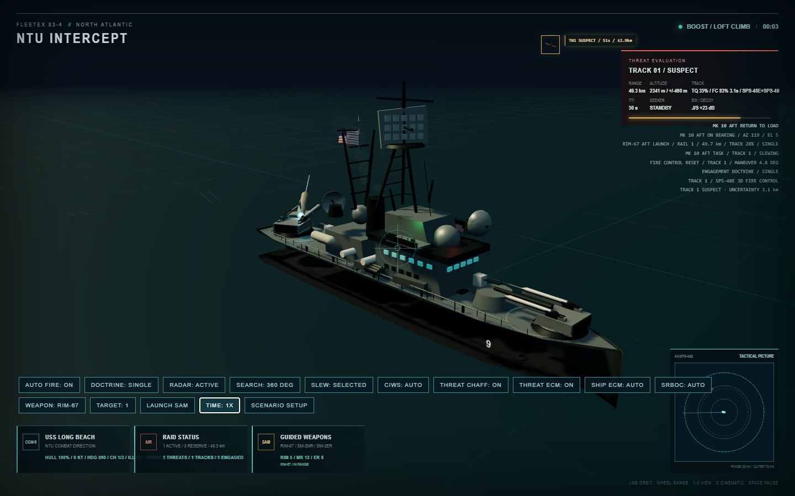

<div align="center">

# NTU Intercept

**A 3D naval air-defense and anti-ship missile interception sandbox with selectable USS Long Beach (CGN-9) and USS Lake Champlain (CG-57)**

[](README.md)
[](README_EN.md)

</div>

> [!IMPORTANT]
> This project uses real ship, radar, weapon, and missile names to establish its period and system relationships. All performance figures are game-scaled. This is not a weapon-performance database, an engineering analysis tool, or a training system, and it must not be interpreted as a statement of real equipment capability.


<a id="table-of-contents"></a>
## Table of Contents

- [1. Overview](#overview)
  - [Design Goals](#design-goals)
  - [Current Scope](#current-scope)
- [2. Quick Start](#quick-start)
  - [Requirements](#requirements)
  - [Install and Run](#install-and-run)
  - [Production Build](#production-build)
- [3. Controls](#controls)
  - [Combat Controls](#combat-controls)
  - [Camera and Keyboard](#camera-and-keyboard)
  - [Scenario Editor](#scenario-editor)
- [4. Simulation Loop and Time](#simulation-loop)
- [5. Sensors and Tracks](#sensors-and-tracks)
  - [Mechanical Scan and AN/SPY-1B Phased Array](#radar-model)
  - [Detection Probability and Horizon](#detection-model)
  - [Association, Error, and Fire-Control Solutions](#track-model)
- [6. Incoming Weapon Model](#incoming-weapons)
- [7. SAMs and Guidance](#sam-guidance)
  - [Weapon Parameters](#sam-parameters)
  - [Two-Stage Guidance](#two-stage-guidance)
  - [RIM-67 Active Terminal Guidance](#rim67-terminal)
  - [SM-2 and Shipboard Illumination](#sm2-illumination)
  - [Flight Physics and Hit Resolution](#interceptor-physics)
- [8. Engagement Planning and Channels](#engagement-planning)
  - [Doctrine](#doctrine)
  - [Channels and Assignment](#fire-channels)
- [9. Mk 10 Twin-Arm Launchers](#mk10-launchers)
  - [Mk 41 Vertical-Launch Sequencer](#mk41-sequencer)
- [10. Electronic Warfare and Decoys](#electronic-warfare)
  - [Threat ECM and Chaff](#threat-ew)
  - [Shipboard AN/SLQ-32 ECM](#ship-ecm)
  - [Mk 36 SRBOC](#srboc)
- [11. Ship Maneuver and CIWS](#maneuver-and-ciws)
- [12. Subsystem Damage](#subsystem-damage)
  - [Hit Location and Damage Allocation](#damage-allocation)
  - [Mechanical Effects of Damage](#damage-effects)
- [13. 3D Presentation and Ship Model](#presentation)
- [14. After Action Review](#aar)
- [15. Values, Units, and Determinism](#values-and-units)
- [16. Project Structure](#project-structure)
  - [Module Boundaries](#module-boundaries)
  - [Adding Ships and Weapons](#adding-ships-and-weapons)
- [17. Development and Verification](#development)
- [18. Known Boundaries and Future Work](#known-boundaries)
- [19. License and Security](#license-and-security)

<a id="overview"></a>
## 1. Overview

NTU Intercept is a Three.js browser-based 3D combat sandbox. The player can select the Mk 10-equipped USS Long Beach (CGN-9) or the AEGIS/SPY-1B and Mk 41-equipped USS Lake Champlain (CG-57) against P-15 Termit, P-500, P-700, Kh-22, and RGM-84 Harpoon raids while managing the complete air-defense chain.

### Joint Air Operations

The scenario panel's `AIR PRESET` offers `JOINT`, `INTERCEPT`, and `STRIKE`. Joint adds two-ship F-14A, Tu-16K, and A-6E formations; intercept keeps only F-14A/Tu-16K; strike keeps only A-6E. Formation composition, coordinates, mission overrides, and escort relationships live in `src/air/scenarios.ts`; core runtime receives only `AirSpawn[]`. Fuel consumes the dynamics core's per-tick burn exactly once, and `consumeFuel` prevents negative inventory or duplicate timestep application.

Each aircraft has three-dimensional point-mass flight, speed-dependent turn authority, stall recovery, fuel, formation following, noisy radar tracks, autonomous OODA decisions, ECM, physical chaff/flare objects, and separate structure, engines, radar, flight-control, and weapon-system health. Air-weapon launch range and initial command guidance consume the observed `AirTrack`, not target truth. KSR-5 is capped near game-scaled Mach 3.1. Hostile aircraft and air-launched anti-ship missiles both enter the existing ship search-radar, 3D-track, fire-control, engagement-queue, magazine, and physical Mk 10/Mk 41 launch sequence. Released anti-ship weapons receive higher defensive priority than their carriers. SAM hits apply aircraft subsystem damage but hard-kill missile targets. The air runtime cannot spawn a shipboard SAM. Leakers produce hull and subsystem damage plus explosion, fire, and smoke feedback. All figures are game-scaled.

Aircraft weapons now pass through catalog-declared physical hardpoints: compatibility and fire-control-channel reservation, release delay, world-transform-preserving separation, ejector drop, and delayed motor ignition all occur before guidance takeover. Ammunition is deducted on physical release and strike aircraft egress only after successful separation. `npm run verify:air-hardpoints` checks authorization, hardpoint depletion, separation, and ignition ordering.

Air-to-air seeker decisions are centralized in `src/air/guidance.ts`. Phoenix remains on launcher-track midcourse guidance outside its active-seeker envelope; active capture includes range, FOV, RCS, ECM, and burn-through, then converts target truth into a deterministic noisy measurement before aim guidance. Sparrow requires a live, fresh illumination track inside the radar sector. Sidewinder capture includes infrared signature, target aspect, low-altitude background, and physical flare competition. Aircraft defensive geometry consumes warning-track estimates rather than the warned missile's truth position and velocity. `npm run verify:air-guidance` is the browser-free gate.

Chaff and flares are ejected one physical object at a time using `CountermeasureProgram.interval`, with inventory deducted on each actual release. `src/air/flight-dynamics.ts` now owns speed-dependent load authority, flight-control degradation, roll-rate limits, pitch/AOA limits, stall state, and throttle/climb-dependent fuel flow. `verify:air-countermeasures` and `verify:air-dynamics` cover these paths.

Two-aircraft formations derive their three-dimensional slot from the leader's horizontal heading and use hysteretic `joined / separated / rejoining` states; a separated wingman prioritizes rejoin geometry. `src/air/damage.ts` centralizes disposition and model-local hit zones: nose, engine-bay, outer-wing, tail-control, and fuselage impacts affect the corresponding systems instead of selecting one randomly. `verify:air-formation-damage` and `verify:air-damage-geometry` cover formation transitions, critical thresholds, and hit regions.

Aircraft models now contain persistent smoke and fire nodes driven by subsystem damage. `stepAircraftLossOfControl` integrates mission-kill descent, roll, gravity growth, and sea contact at the fixed timestep; impact zeros velocity while preserving visible wreckage and an expanding splash instead of hiding the model. The joint-air HUD lists mission, formation state/error, best track quality, fuel, remaining weapons, and confirmable damage without leaking unobserved enemy subsystem health.

Launch-resource policy has moved out of `air/runtime.ts` into `src/air/launch-management.ts`: live and pending weapons both consume datalink/illumination channels, while selection jointly checks classification, range, inventory, channel capacity, and a compatible physical hardpoint. Countermeasure cooldown, inventory, and timed-release scheduling live in `src/air/countermeasure-program.ts`. `scripts/verify-air-resources.mjs` verifies both resource paths without a browser.

Mission-level OODA policy lives in `src/air/ooda.ts`: CAP, intercept, escort, and anti-ship selection consume only track classification and estimated position, while defensive beaming and TTI consume only missile-warning tracks. Escort relationships are scenario data through `AirSpawn.mission` and `protectedFormationId`; runtime resolves the protected leader without F-14/A-6 ID branches. The escort uses that aircraft as its threat-priority origin and reuses formation-slot/rejoin behavior. Without a valid surface track, a strike aircraft holds its prebriefed heading or formation slot instead of reading the ship truth transform.

Track lifecycle now lives in `src/air/track-store.ts`. Estimated position, quality, and uncertainty propagate/age on every physics tick, while a radar scan only writes a fresh noisy measurement; a newly measured track is no longer incorrectly advanced by one full scan interval. Weak contacts plus missiles/decoys remain `unknown`, and stale or low-quality tracks expire through one shared policy. `verify:air-tracks` covers measurement, continuous propagation, classification, and expiry.

Air-to-air phase policy now begins moving into `src/air/missile-runtime.ts`. Before seeker capture, phase transitions and steering consume only the command track; seeker measurements become available only after capture. A weapon whose target entity disappears continues toward its last command point until endurance or sea impact instead of being deleted. CAP completion likewise uses local observed tracks, warnings, and prior engagement state rather than global hostile-entity counts.

Joint ship/air defense tracks now use stable entity-source references. Aircraft and air-launched weapons are no longer inserted into the legacy `missiles[]` collection solely to obtain an array index; search radar, threat ranking, Mk 10/Mk 41 queues, illuminators, CIWS, deterministic seeds, and AAR resolve them through the shared defense-target registry. A SAM mission kill also leaves aircraft model visibility under the air-damage runtime so loss-of-control, fire, and sea-impact behavior can continue.

The shipboard interception chain now consumes the minimal `DefenseTarget` contract. A legacy `Missile` extends that contract with its own history, path, launch timing, and attitude state; aircraft and air-launched weapon defense records carry none of those fabricated fields. The joint verifier asserts both zero registration in `missiles[]` and zero legacy missile-runtime fields on air targets.

`DefenseTarget` now retains the real `CombatEntity` reference, from which shipboard systems obtain stable identity, side, category, position, velocity, signatures, and alive state. The former `externalAirEntityId`, `externalAirCategory`, `externalAirMissileId`, and `externalDisplayName` side-channel fields are removed; `AirShipDefenseContact` adds only ship-defense display and threat-template data.

Threat-profile identity is now consistently named `DefenseTarget.threatType` for game-scaled P-500, KSR-5, Harpoon, and similar catalog lookups. `CombatEntity.kind` is reserved for the `ship/aircraft/missile/decoy` entity category. Ship guidance, CIWS, HUD, and AAR are migrated, and the joint verifier rejects any reintroduced ambiguous defense-target `.kind` profile field.

Aircraft and air-launched missiles now implement the standard `TargetableEntity.applyDamage` contract. A shipboard SAM hit no longer selects separate aircraft-damage and missile-destruction APIs; it submits damage to the entity and reads the resulting `alive` state. Aircraft callbacks preserve subsystem damage, abort, and loss-of-control behavior, while weapon callbacks terminate and hide the physical weapon.

Air-to-air and air-to-ship proximity/hit resolution now uses the same `TargetableEntity.applyDamage` contract. Weapon runtime owns only fuze geometry, its own termination, and event recording; it no longer edits hostile aircraft, missiles, or ships directly. Decoys remain non-damageable signal entities handled by seeker-capture logic. The joint gate also requires an actual Phoenix active-seeker acquisition event; `verify:air-strike-defense` proves a physical ship hit passed through the standard damage entry point.

`npm run verify:aircraft-sam-damage` uses the intercept preset and requires a physical Mk 10/Mk 41 shot to hit a Tu-16K and emit a model-local zone/subsystem damage event. Shipboard aircraft engagement is therefore proven beyond queue registration or diagnostic shot counts.

`npm run verify:air-intercept` uses the generic `airCountermeasures=off` verification preset and requires Phoenix active-seeker acquisition followed by a physical hit on a Tu-16K. The default joint scenario keeps ECM and physical chaff enabled to verify contested acquisition and soft-kill competition.

KSR-5 and AGM-84A terminal active search is no longer a deterministic range gate: after the field-of-view check, capture uses a deterministic probability sample from target RCS, ECM strength, burn-through state, and a low-terminal-altitude sea-clutter factor; an unsuccessful attempt continues toward the last command point.

`AirCombatSystem.updateMissile()` is now a stage orchestrator instead of one compressed branch block. Release coast, target-loss continuation, midcourse datalink, decoy filtering, seeker capture, semi-active illumination, aim competition, kinematic integration, and fuze resolution have separate methods; anti-ship weapons remain on the shared dedicated anti-ship guidance path.

`npm run verify:joint-air` is the serial browser gate for the joint launch chains. `npm run verify:air-strike-defense` separately proves ship-radar tracks, a physical Mk 10/Mk 41 SAM departure, hard-kill synchronization, and visible leaker damage. Both checks use one constrained Chromium context at a time.

Joint mission completion now waits for airborne weapons and aircraft still executing combat orders. Strike aircraft enter egress after mission-weapon release, while CAP returns only after hostile aircraft and hostile air weapons are gone. AAR snapshots contain aircraft 3D position, mission/state, structure health, air weapons, and physical chaff/flare objects, so clearing the surface-defense queue no longer truncates the air battle record.

Airborne radar now applies RCS fourth-root scaling, radar horizon, sensor precision, system health, ECM range/quality loss, and burn-through distance. Aircraft missile defense consumes short-lived warning tracks; a weapon outside RWR/MAWS/visual warning conditions cannot trigger maneuver or countermeasure deployment. `npm run verify:air-sensors` checks ECM, burn-through, and warning envelopes without a browser.

AGM-84A and KSR-5 now use a side-neutral anti-ship guidance core for catalog-defined boost/midcourse/terminal envelopes, command-track guidance, active-seeker FOV capture, speed, altitude, and turn limits. Air-launched weapons and surface Harpoon share the same fourth-power target/physical-decoy signal contest, ECM, burn-through, and HOJ adjustment. `npm run verify:anti-ship-guidance` and `npm run verify:radar-countermeasures` are browser-free gates.

The combat model is not a simple “target enters a circle and disappears on a dice roll.” Results emerge from an observable engagement chain:

```text
Radar scan -> noisy track -> 3D fire-control solution -> launcher slew
-> ship-guided midcourse -> terminal seeker or illumination -> hit/miss
-> leakers, electronic attack, subsystem damage -> AAR
```

<a id="design-goals"></a>
### Design Goals

- Use real names and period-appropriate technical relationships while clearly keeping values game-scaled.
- Model velocity, acceleration, drag, energy, turn-rate limits, and finite range in 3D space.
- Make sensor error, revisit rate, track quality, and fire-control delay affect the ability to fire.
- Show two-stage guidance: ship-supported midcourse followed by a terminal seeker or illumination.
- Let channels, illuminators, launcher mechanics, and magazines create saturation pressure.
- Make ECM, chaff, burn-through, and false-target capture dynamic processes.
- Let leakers damage specific equipment and change the remainder of the engagement.
- Provide a movable 3D camera, tactical radar, and complete AAR timeline.

<a id="current-scope"></a>
### Current Scope

The current build is a single-ship air-defense and surface-action sandbox. The Slava-class Moskva is both a visible launch platform with sixteen physical P-500 slots and a searchable, trackable, damageable surface target. Both CGN-9 and CG-57 can launch RGM-84 Harpoons from physical Mk 141 hardpoints. Fleet-level CEC, aviation, submarines, multiplayer, and a complete mission-authoring system remain out of scope. Ship and weapon visuals are generated procedurally.

<a id="quick-start"></a>
## 2. Quick Start

<a id="requirements"></a>
### Requirements

- Node.js 20.19+ or Node.js 22.12+
- npm
- A modern browser with WebGL 2 support

<a id="install-and-run"></a>
### Install and Run

```bash
npm install
npm run dev
```

Open the address printed by Vite. The default is usually:

```text
http://127.0.0.1:5173/
```

If port 5173 is occupied, Vite selects another port; use the terminal output as the authority.

<a id="production-build"></a>
### Production Build

```bash
npm run build
```

This runs the TypeScript type check and Vite production bundle. Output is written to `dist/`.

<a id="controls"></a>
## 3. Controls

<a id="combat-controls"></a>
### Combat Controls

| Control | Function |
|---|---|
| `AUTO FIRE` | Enables or suspends automatic defensive fire planning |
| `DOCTRINE` | Cycles through SINGLE, DOUBLE, and SS-L-S |
| `RADAR` | Switches between active emissions and EMCON silence |
| `SEARCH` | Cycles 360°, 120°, and 60° search widths |
| `SLEW` | Points focused search at the selected track |
| `CIWS` | Sets close-in defense to AUTO or HOLD |
| `THREAT CHAFF` | Enables incoming-missile chaff deployment |
| `OPFOR ECM` | Enables threat-side interference against SAM guidance and continuous enemy-platform ECM radiation against Harpoon |
| `OPFOR DECOYS` | Independently sets finite enemy-platform decoy deployment to AUTO or HOLD |
| `OPFOR RADAR` | Controls enemy-platform emissions; silence blocks new fire-control tracks and makes airborne weapons coast on their last estimate |
| `SHIP ECM` | Sets shipboard ECM to AUTO or HOLD |
| `SRBOC` | Sets Mk 36 chaff deployment to AUTO or HOLD |
| `WEAPON` | Cycles RIM-67, SM-2MR, and SM-2ER |
| `TARGET` | Cycles through surviving targets |
| `LAUNCH SAM` | Requests a manual shot against the selected target |
| `TIME` | Cycles 1X, 2X, and 4X simulation speed |
| `SCENARIO SETUP` | Pauses and opens the scenario editor |

Manual fire does not bypass fire-control rules. A request is rejected when there is no track, no SPS-48E altitude solution, insufficient solution quality, a stale track, an invalid range, exhausted channels, or no serviceable launcher.

<a id="camera-and-keyboard"></a>
### Camera and Keyboard

| Input | Function |
|---|---|
| Mouse drag | Orbit the camera |
| Mouse wheel | Zoom in or out |
| `1` | Close ship view |
| `2` | Default tactical view |
| `3` | Wide ship-to-target view |
| `4` | Follow an active interceptor, or the selected incoming missile when no interceptor is active |
| `5` | Focus the active enemy launch platform |
| `C` | Toggle cinematic orbit |
| `Space` | Pause or resume |
| `R` | Reload the page |

<a id="scenario-editor"></a>
### Scenario Editor

The editor configures:

- Incoming missile type, count, interval, initial altitude, center coordinates, and formation spread.
- Attack origin can remain a legacy airborne formation or use the cataloged Slava-class Moskva. Platform selection filters both wave selectors and maximum load through weapon-slot compatibility.
- Ripple or simultaneous arrival pattern.
- Initial USS Long Beach coordinates.
- RIM-67, SM-2MR, SM-2ER, and CIWS ammunition.
- SAM engagement channels and the selected ship's fire-control illuminator count.
- A second wave with independent type, count, and delay.
- `SEA SKIMMER`, `SATURATION`, and `HIGH SPEED` presets.
- Direct ship and raid placement by clicking the tactical radar.

Starting a scenario clears tracks, AAR data, explosions, fires, missiles, illumination tasks, and subsystem damage, and resets both Mk 10 launchers.

<a id="simulation-loop"></a>
## 4. Simulation Loop and Time

Combat logic uses a fixed `0.05 s` simulation step. Display frame rate does not change missile physics, mechanical timing, or fire-control ordering. The 1X, 2X, and 4X settings only control how much simulated time accumulates per real-time interval.

The approximate fixed-step order is:

```text
CIWS -> booster debris -> chaff/decoys
-> enemy-platform sensors/launch slots -> radar and tracks -> ship OODA maneuver -> Mk 10 mechanics
-> fire planning and illuminators -> interceptor guidance/hit resolution
-> incoming seeker, ECM, maneuver, and ship impact
-> AAR snapshot
```

Visual radar rotation, sea animation, fire, smoke, and some HUD updates are independent of the fixed step and do not directly decide combat outcomes.

<a id="sensors-and-tracks"></a>
## 5. Sensors and Tracks

<a id="radar-model"></a>
### Mechanical Scan and AN/SPY-1B Phased Array

| Radar | Dimension | Base Revisit | Game Max Range | Altitude | Primary Role |
|---|---:|---:|---:|---|---|
| AN/SPS-48E | 3D | 0.75 s | 65 km | Yes | Altitude and fire-control solutions |
| AN/SPS-49 | 2D | 1.15 s | 105 km | No | Long-range warning and horizontal tracks |
| AN/SPY-1B | 3D phased array | 0.42 s | 82 km | Yes | Multifunction search, tracking, and fire-control solutions |

Focused 60°/120° search shortens revisit time and improves measurement quality. AN/SPS-48E and AN/SPS-49 use the mechanical-scan model, so antenna time committed to a focused sector does not refresh targets outside it. CG-57's four fixed AN/SPY-1B arrays use a separate electronic-scan model: the focused sector receives fast revisits while a slower schedule preserves 360-degree background surveillance. Concentrating fire-control resources therefore does not make the ship blind everywhere else. SPS-49 can create early 2D warning tracks but cannot independently satisfy the altitude requirement for SAM fire.

<a id="detection-model"></a>
### Detection Probability and Radar Horizon

Effective detection range uses a fourth-root RCS relationship:

```text
effectiveRange = maxRange * (max(0.05, targetRCS / 0.5))^0.25 * sensorHealth
```

The model also considers radar height, target altitude, range ratio, focused search, and a radar-horizon factor. Passing the range gate does not guarantee detection: a deterministic pseudo-random check remains. Long range, low altitude, low RCS, and sensor damage all reduce scan success.

The relationship is intended to produce explainable gameplay. Constants and ranges are game-scaled, not engineering specifications.

<a id="track-model"></a>
### Association, Error, and Fire-Control Solutions

Radar reports do not copy target truth. Each measurement receives position and altitude error based on measured quality. Association uses predicted position, velocity, revisit interval, and an uncertainty gate.

- Track quality decays with age while uncertainty grows.
- 3D altitude data expires after roughly four seconds without an update.
- Tracks are labeled `unknown`, `suspect`, or `classified` by quality.
- Significant target maneuvers reset or reduce the fire-control solution.
- Fresh 3D tracks accumulate `solutionQuality`; 0.45 is required to fire.
- Tracks older than 2.2 seconds are stale for launch authorization.
- Very low-quality tracks or tracks older than 160 seconds are removed.

<a id="incoming-weapons"></a>
## 6. Incoming Weapon Model

| Type | Cruise Altitude | Terminal Altitude | Cruise/Terminal Speed | Terminal Starts | Game Damage | Character |
|---|---:|---:|---:|---:|---:|---|
| P-15 Termit | 98 m | 12.5 m | 6.2 / 6.4 u/s | 24 km | 32% | Active radar at roughly 13 nmi; holds 320 ft until a steep descent in the final 5.4 km |
| P-500 | 60 m | 15 m | 8.8 / 9.6 u/s | 18 km | 28% | Sea skimming and terminal maneuver |
| P-700 | 130 m | 20 m | 9.8 / 10.8 u/s | 22 km | 38% | Faster with stronger terminal weaving |
| RGM-84 Harpoon | 45 m | 6 m | 5.8 / 6.4 u/s | 13 km | 20% | Compact low-RCS subsonic sea skimmer with active terminal homing and quick, restrained maneuver |
| Kh-22 | 18,000 m | 110 m | 13.2 / 15.2 u/s | 45 km | 46% | High-altitude, high-speed dive; difficult for CIWS |

Incoming weapons transition through `inbound -> midcourse -> terminal`. Altitude, speed, and maneuver amplitude interpolate continuously during terminal entry. Each missile has a turn-rate limit, speed response, bank visualization, active-seeker activation, line-of-sight aim point, and closest-approach history. Harpoon enters terminal flight at roughly 13 km, activates its seeker, and descends continuously from about 45 m to about 6 m. Its terminal weave is quicker but substantially smaller than P-700's, while the 3D view shows sea mist, seeker field of view, and bank response. The game-scaled model assigns most rounds a direct skim profile and a minority a late pop-up/dive profile; strong shipboard jamming can expose an emitter bearing and trigger a simplified home-on-jam state.

P-15 uses separate seeker-activation and descent gates. It enters active-radar guidance at roughly 24 km while retaining its approximately 320-foot cruise altitude, then descends sharply only inside the final 5.4 km. The reference envelope gives a 21.6 nmi total path and still shows 320 ft at 18.7 nmi, leaving about 2.9 nmi (5.4 km) for the independent terminal descent instead of treating P-15 as an end-to-end sea skimmer.





### Enemy Launch-Platform Loop

The Slava-class Moskva is the first cataloged enemy platform. Its definition declares MR-800, MR-700, and Argument sensor slots plus one P-500-compatible `inclined-canister` weapon slot. Its model exposes a standard `platformSlots` manifest with sixteen physical Bazalt hardpoints, tube-axis directions, and individual releasable covers. Runtime first proves that declared capacity equals model hardpoint count, then reserves unused hardpoints across the primary and second waves while sharing one `nextAvailable` time for mechanical spacing.

A platform-launched P-500 is not spawned in open air. It starts at a specific tube's world position and moves through `TUBE EXIT -> BOOST -> PROGRAM TURN -> MIDCOURSE TAKEOVER` using the slot-defined axis, exit speed, boost duration, and takeover time. Only after takeover does it enter the generic P-500 envelope, radar-altimeter, and terminal-guidance logic. Cover and hardpoint states remain one-to-one, so a fired tube cannot be reserved again by a later wave.

Moskva sensors maintain a target track separate from truth, including position/velocity error, quality, uncertainty, and refresh time. Each scan applies fourth-root target-RCS range scaling, antenna/target radar horizon, subsystem health, refresh cadence, and a deterministic detection probability before accepting a new measurement. A missed scan decays sensor quality and preserves fresh track memory rather than fabricating a report. A P-500 receives command-point updates at the slot-defined 1.4-second interval with 0.35-second link latency and propagates estimated velocity between messages. Radar silence, insufficient quality, or platform destruction produces `PLATFORM DATALINK LOST`; the missile then coasts on its last estimate instead of reading friendly-ship truth.

When the navigation point enters the programmed terminal region, P-500 first enters `ACTIVE SEEKER SEARCH`. It records `TARGET ACQUIRED` only when the real target is inside the game-scaled acquisition range and 50-degree field of view, then stops platform updates and becomes `terminal-autonomous`. Ship ECM, SRBOC chaff, HOJ, and terminal maneuver resolution apply only after acquisition. The front-end state chain is `SHIP GUIDED -> INERTIAL` on link loss `-> ACTIVE SEARCH -> ACTIVE`.

Each platform weapon slot declares minimum track quality, continuous track age, fire-control reaction time, and direct-track holdover. A reservation does not guarantee immediate launch: Moskva must hold an adequate track for 2.4 seconds and then complete a 1.6-second fire-control/command delay. A natural missed scan may preserve and slowly decay the existing solution for 2.2 seconds, and ESM cannot overwrite fresh direct-radar memory. Explicit radar silence or expiry of that memory immediately revokes authorization for remaining rounds. Rounds that become due while waiting still obey the scenario interval and mechanical minimum during actual release rather than leaving together on the ready frame. The Bazalt slot uses the generic `alternate-groups` policy, producing physical port/starboard order `01,09,02,10...`; a later reservation cannot overtake an earlier one merely because their fire-control retry timers fall on different frames. If the platform is disabled, unreleased reservations enter a distinct `canceled` state and retain their covers, while missiles already clear of their tubes continue the attack. Canceled rounds are never counted as fired.

### Surface-action loop

Both selectable ships declare a data-driven `surfaceStrike` capability and eight physical Mk 141 hardpoints. A separate surface picture tracks the enemy platform with refresh, uncertainty, RCS, sensor health, and quality effects. A correlation-ID change, quality drop, or report age above four seconds breaks continuity. A stale report remains visible as tactical history but cannot continue fire-control buildup, authorize a new launch, or refresh an airborne missile. CG-57 requires 2.2 seconds of confirmation plus a 1.6-second fire-control delay, while CGN-9 requires 2.8 plus 2.2 seconds. Fire planning sizes each wave from the intelligence estimate of target durability, weapon damage, prior leak probability, and resolved hit/intercept outcomes. The first wave is capped at four; no additional weapons may be committed while that wave is airborne or inside the BDA delay, and a re-attack shrinks to the estimated hits still required. `SURFACE STRIKE` hold and `LAUNCH HARPOON` manual control pass through the same gates.

Platform engagements no longer deadlock beyond the organic radar horizon. An emitting opponent creates a passive `0.12-0.20` quality ESM cue with large range uncertainty, drawn as a purple dashed bearing and `ESM` diamond. This cue may drive OODA closing maneuver but cannot build weapon fire-control track age. Harpoon or P-500 launch is permitted only after the ships enter organic radar coverage and obtain a qualified direct track. Selecting a ship-launched attack defaults to roughly 42 km ship separation for an immediately observable engagement; manually placing it beyond 60 km exercises the ESM-guided approach.

Harpoon salvo doctrine assigns alternating lateral midcourse routes, a merge range, a common planned arrival window, and bounded speed compensation from each ship definition. Route offsets wash out before active-seeker terminal entry, and no weapon can teleport or exceed the configured compensation limit. `npm run verify:surface-salvo` checks bilateral departure at close range, opposed routes and arrival timing for four Harpoons, plus far-range ESM closing without premature fire.

The surface-contact card exposes the opposing engagement chain as `OPFOR ESM CUE -> TRACK BUILD -> FC BUILD -> FC READY -> LAUNCHED`, so radar-horizon delay, continuous track age, and fire-control reaction no longer look like an unresponsive launcher. `npm run verify:bilateral-launch` runs both CGN-9 and CG-57 against Moskva, requires friendly Harpoon departure and physical P-500 tube departure in both cases, and captures desktop plus mobile layouts.

Platform scenarios repurpose the AIR RAID card as an `SFC` surface-contact card. It shows only `SURFACE CONTACT` below the classification threshold and reveals the ship name after identification. `TRACK BUILD -> FC ASSIGN -> BDA PENDING` exposes OODA progress. Surface radar also applies the horizon from both antenna heights and significant target height: beyond direct line of sight it retains only a low-probability, low-quality intermittent contact, marks the card `HORIZON LIMITED`, and records the intermittent state in the event feed; it cannot build fire control. Inside the horizon it marks `LOS` and restores normal measurement. After a confirmed hit, a capability-defined `BDA ASSESS` interval precedes any result. The resulting combat-power interval or disabled confidence comes from the friendly target-durability prior, confirmed hits, weapon-effect uncertainty, and current track quality. The live HUD and combat log no longer print true remaining hull or true damaged-subsystem identity.

Each Harpoon departs along its actual launcher axis and transitions through `boost -> datalink midcourse -> inertial coast` on link loss `-> active search -> terminal autonomous`. Each datalink message contains only an uncertain position/velocity estimate, which the missile propagates between updates. Friendly radar silence, inadequate track quality, or track loss leaves the round coasting toward its last command point. Reaching the game-scaled 13 km terminal region starts a search but does not grant truth guidance: the real target must enter the 50-degree field of view and acquisition range before `TARGET ACQUIRED`. Only then may the missile track platform truth, apply limited velocity lead, and participate in platform ECM/decoy resolution. A round that never acquires passes its final command point and resolves as an independent miss.

Platform point defense no longer reads Harpoon truth range directly. Moskva maintains one independent incoming track per missile. Inside the game-scaled 11.5 km detection envelope it scans every 0.72 seconds; sea-skimming altitude and radar-subsystem damage reduce detection probability and track quality. A track below `0.30` quality or more than 3.2 seconds since refresh is invalid. A valid track still requires 1.35 seconds of fire-control reaction before it may occupy either of two independent point-defense channels. The platform forms a deterministic threat order from observed closing speed, estimated time to impact, range, track quality, and local track density. Defensive-beam maneuvering and point-defense allocation share that order instead of using Harpoon creation order. Kill probability includes track quality, position uncertainty, subsystem health, and observed local saturation; an undetected truth contact contributes no saturation penalty. Point-defense health also changes effective channels, fire-control reaction, and channel cycling: at 45% health Moskva drops from two channels to one with a 1.44 reaction multiplier and 1.55 cycle multiplier; at five percent or below it is fully offline without deleting tracks. `OPFOR POINT DEFENSE HEALTH` in the scenario panel exposes this for testing. A shot no longer resolves in its firing frame: the game-scaled combined point-defense effector travels at 4 km/s toward the firing solution, its channel remains occupied until arrival, and the incoming missile keeps moving. A shot arriving after Harpoon impact cannot retroactively intercept it. Moskva also carries six game-scaled effective firing bursts, representing complete tracking, stabilized-fire, and cooling opportunities rather than literal cannon rounds. Each shot consumes one immediately, in-flight effectors may still resolve after the last burst is committed, and the next eligible track records one `MAGAZINE DEPLETED` event before continuing inbound. Point defense then uses finite shoot-look-reengage behavior: a first miss preserves both missile and track, and the same track independently waits 0.9 seconds after resolution for observation and a new solution instead of transferring immediately to another free channel. Moskva permits at most two attempts per target; a second miss produces a leaker. `OPFOR RADAR: SILENT` prevents new defensive tracks, while ECM remains controlled independently.

Destroying the target no longer removes every other airborne Harpoon. Each round records target loss independently, stops datalink and truth homing, continues toward the final known aimpoint, and later resolves as `TARGET DESTROYED / AIMPOINT LOST`. The 3D scene and AAR therefore retain the lifecycle of every weapon in the salvo.

Harpoon impact no longer uses a 7.5-unit sphere around the platform center. Missile position is transformed into platform-local coordinates and tested against a hull envelope derived from the real model length and beam, with beam taper toward bow and stern; defensive beam maneuvering can therefore produce genuine side contact. Contact records `PENETRATION` and enters a no-longer-interceptable penetration phase without changing hull or subsystem health. Only after the RGM-84's game-scaled 0.32-second fuse delay does `INTERNAL DETONATION` create the internal blast and begin BDA. Moskva's BOW/FORWARD/AMIDSHIPS/AFT definition zones map actual local longitudinal contact to radar, weapon, propulsion, point-defense, or electronic-warfare candidates instead of selecting a system across the whole ship.

Each internal detonation also creates an independent casualty whose fire and flooding strengths derive from waterline height and side penetration. The platform performs a game-scaled damage-control update every two seconds: `damage-control` health interpolates between controlled decay and uncontrolled growth factors, and every cycle applies progressive hull loss. A casualty below threshold records `CONTAINED`; otherwise it may continue after all missiles resolve and independently produce `DISABLED BY PROGRESSIVE DAMAGE`. `OPFOR DAMAGE CONTROL HEALTH` exposes the capability in the scenario panel. A surviving platform with an active casualty keeps the mission in `DAMAGE ASSESSMENT` instead of opening AAR early, and AAR reports cumulative `PROG DAMAGE` separately.

Platform maximum, patrol, and cruise speeds, acceleration, turn rate, decision cadence, and standoff ring all come from its definition. Once per second its OODA patrols without a valid target track; uses only the uncertain target track to close, hold standoff, or withdraw; and selects the lower-turn beam direction at available maximum speed when a qualified Harpoon track appears. Defender truth is only a radar-measurement input and never directly selects a maneuver. Propulsion and hull damage limit achieved speed and turning, while a destroyed platform enters `disabled` and decelerates. Each Harpoon hit also damages a deterministic subsystem and leaves persistent fire and smoke. Sensor damage degrades track quality and antenna rotation; point-defense and EW damage reduce their corresponding kill probabilities. Mission completion waits for all incoming weapons, Harpoons, queues, and ship launch mechanisms before declaring a surface kill or a failed strike with the target surviving.

<a id="sam-guidance"></a>
## 7. SAMs and Guidance

<a id="sam-parameters"></a>
### Weapon Parameters

| Weapon | Game Envelope | Max Speed | Boost | Base Turn Rate | Terminal Range | Terminal Guidance |
|---|---:|---:|---:|---:|---:|---|
| RIM-67 | 2-75 km | 12.5 u/s | 5.2 s | 18°/s | 18 km | Game-modeled active seeker |
| SM-2MR | 1.5-45 km | 13.5 u/s | 4.4 s | 22°/s | 10 km | Shipboard semi-active illumination |
| SM-2ER | 2.2-90 km | 14.2 u/s | 6.2 s | 16°/s | 19 km | Shipboard semi-active illumination |

These values exist only for this project’s world scale and combat pacing.

<a id="two-stage-guidance"></a>
### Two-Stage Guidance

The missile leaves from the selected Mk 10 rail’s actual position and orientation. Midcourse guidance does not directly chase target truth; it follows a `commandPoint` and `commandVelocity` derived from the fire-control track:

1. The ship sends delayed datalink updates based on track quality.
2. Update spacing varies with quality; missing data causes inertial extrapolation.
3. Trajectory selection follows the threat profile: P-15, P-500, P-700, and Harpoon use a low-altitude forward-intercept corridor, while high-altitude targets such as Kh-22 retain a lofted trajectory. Against low-altitude threats, Mk 41 rounds hold vertical only long enough to clear the ship before a rapid programmed turn.
4. Inside terminal range, control transfers to an active seeker or the selected ship's fire-control illumination.

<a id="rim67-terminal"></a>
### RIM-67 Active Terminal Guidance

The active seeker here is a deliberate game treatment for two-stage guidance and is not a strict representation of every real RIM-67 configuration.

- The seeker activates in terminal range and warms up for about 0.35 seconds.
- Acquisition considers field of view, range, handoff error, RCS, nearby competing targets, and sea clutter.
- After capture, the seeker produces a noisy aim point at a finite update rate.
- Excessive boresight angle or line-of-sight rate can break lock.
- A short track-memory period follows lock loss; prolonged failure to reacquire causes a miss.

<a id="sm2-illumination"></a>
### SM-2 and Shipboard Illumination

SM-2MR/ER also receive midcourse updates but require continuous shipboard fire-control illumination in terminal flight. USS Long Beach uses two AN/SPG-55 directors; USS Lake Champlain uses four AN/SPG-62 directors. Available illumination is constrained by the actual mounts and equipment count of the selected ship.

- The illuminator must slew to the target and enter its angular capture gate.
- Illumination channels are finite; missiles against the same target may share an established illumination.
- Bearing solutions use ship-local coordinates, so ship maneuvers do not corrupt director target bearings.
- More than roughly 2.5 seconds without illumination causes an illumination-loss miss.
- Fire-control damage reduces slew speed and removes channels according to the selected ship's installed director count.

<a id="interceptor-physics"></a>
### Flight Physics and Hit Resolution

Each interceptor stores velocity, distance traveled, energy, boost state, and trajectory history. Its update includes:

- Boost acceleration and booster separation.
- Turn-rate limits and gradual direction changes.
- Drag and energy loss under high turn demand.
- Midcourse loft, terminal maneuver, and range exhaustion.
- Segment closest-point checks to prevent high-speed targets from tunneling through a hit sphere.
- Final PK derived from guidance quality, geometry, remaining energy, saturation, and illumination state.
- Closest-approach and opening-range logic to identify a fly-by miss.

<a id="engagement-planning"></a>
## 8. Engagement Planning and Channels

<a id="doctrine"></a>
### Doctrine

| Doctrine | Behavior |
|---|---|
| `SINGLE` | Maintains one assigned interceptor at a time to conserve rounds |
| `DOUBLE` | Attempts to maintain two interceptors per target |
| `SS-L-S` | Shoot-Shoot-Look-Shoot: fires two, observes results, then permits follow-up shots up to four total |

Threat ranking combines time to impact, flight phase, missile type, and track quality. Terminal, fast, and close threats receive priority.

<a id="fire-channels"></a>
### Channels and Assignment

- Accepted launcher tasks count against SAM channels and per-target assignment before physical launch.
- Mechanical slew delay cannot cause the planner to allocate unlimited duplicate shots.
- A request is rejected when both Mk 10 launchers are busy or disabled.
- Terminal SM-2 flight also consumes a separate fire-control illumination resource: two AN/SPG-55 directors on CGN-9 and four AN/SPG-62 directors on CG-57.
- The automatic planner only considers targets with a fresh 3D solution inside a weapon envelope.

<a id="mk10-launchers"></a>
## 9. Mk 10 Twin-Arm Launchers

The forward and aft Mk 10 mounts each use a fixed-step mechanical state machine:

```text
READY -> SLEWING -> FIRING -> RETURNING -> LOADING -> READY
```

1. After tasking, the mount calculates relative azimuth and elevation from the current radar track.
2. Base game slew rates are approximately 55°/s in azimuth and 25°/s in elevation.
3. Inside an approximately 2° alignment gate, the selected rail model supplies its world position and quaternion.
4. The interceptor starts with rail-aligned velocity and orientation rather than spawning at ship center.
5. The mount holds the firing pose briefly, returns to the loading bearing, and lowers to zero elevation.
6. The fired rail’s visible round moves from the loading position back onto the rail; the next cycle alternates arms.
7. A destroyed target or prolonged track loss during slew cancels the request, refunds ammunition, and returns the mount.
8. Damage slows slew and reload; health at or below 5% prevents new tasking.

<a id="mk41-sequencer"></a>
### Mk 41 Vertical-Launch Sequencer

CG-57's forward and aft Mk 41 banks are independent launch resources that may work in parallel, while each bank has its own ignition sequencer:

- Each of the 122 physical cells is bound to `SM-2MR`, `SM-2ER`, or a reserved non-air-defense load. A task can only select a cell loaded with the requested weapon.
- The default air-defense load is 48 SM-2MR, 32 SM-2ER, and 42 other-load cells. Sandbox requests above 122 are scaled proportionally instead of creating ammunition without physical cells.
- A cell proceeds through hatch opening, hot launch, exhaust clearance, and hatch closing, then remains permanently spent.
- Ammunition is reserved when hatch opening begins. A pre-launch cancellation caused by target destruction or bank failure refunds the same weapon and closes back to `ready`; only a round that physically leaves the cell transitions to `spent`.
- Successive ignitions in one bank obey a game-scaled minimum interval; bank damage lengthens that interval.
- A cell that is opening or hot launching creates a temporary one-cell safety boundary around itself.
- Adjacent cells are hard-inhibited while exhaust from the previous launch remains near the deck; allocation prefers cells farther from the previous launch.
- Tasks alternate between banks and may transfer when one bank is damaged, busy, or has no safely available cell.
- Runtime diagnostics record each bank's minimum ignition interval, launch-cell history, per-weapon ready/pending counts, spent cells, and cancellation returns for salvo-safety and ammunition-conservation checks.
- Below 75% bank health, a local cluster around the damage center is isolated. Air-defense rounds in those cells become trapped and are removed from available ammunition. At or below 5%, every remaining unlaunched cell in that bank is disabled while the opposite bank may continue independently.
- Scenario setup exposes separate initial health values for the forward and aft launch systems, allowing repeatable partial-damage, single-bank-failure, and asymmetric-ammunition tests.

<a id="electronic-warfare"></a>
## 10. Electronic Warfare and Decoys

<a id="threat-ew"></a>
### Threat ECM and Chaff

`OPFOR ECM` adds a range-dependent aim-point error to terminal SM-2 guidance. As the interceptor closes, it enters burn-through range and interference falls, generating an `ECM BURN-THROUGH` event. In a surface action ECM represents continuous radiation from the enemy ship's electronic-warfare antennas; it is not a projectile. `OPFOR DECOYS` independently controls the finite rounds that leave the ship. Moskva carries eight game-scaled decoys and releases an orange cloud abeam only after a qualified incoming track enters the 9 km observed deployment region, subject to a 2.2-second base cooldown. `electronic-warfare` health controls jammer strength, while independent `countermeasures` health controls launcher availability and cooldown; the scenario panel exposes `OPFOR ECM HEALTH` and `OPFOR DECOY LAUNCHER HEALTH`. Platform release range and bearing use the noisy track estimate, never the Harpoon truth transform; only the Harpoon's seeker may use its own range after acquisition for signal competition.

Harpoon soft-kill resolution compares ship return, decoy RCS, missile distance to each, ECM strength, electronic-warfare health, the HOJ threshold, and a 2.4 km burn-through range. Outcomes include `DECOY REJECTED`, `ECM CONTESTED`, `ACTIVE / HOJ`, `BURN THROUGH`, or a soft kill recorded as `DECOY`, `ECM`, or `ECM + DECOY`. Pure decoy capture no longer depends on ECM health. Disabling `OPFOR ECM` stops only radiation; setting `OPFOR DECOYS` to HOLD stops only deployment, while point defense remains independent.

Incoming missiles can also deploy chaff. Terminal SM-2 compares target and chaff radar cross sections and may record `DECOY CAPTURE`. Chaff expands, drifts, and decays over time.

<a id="ship-ecm"></a>
### Shipboard AN/SLQ-32 ECM

Shipboard ECM is electromagnetic radiation from the ship’s electronic-warfare antennas, not a projectile.

- At long range, ECM produces a dynamic seeker aim-point error.
- As the missile closes, ship return dominates and burn-through occurs.
- AN/SLQ-32 health affects both interference power and burn-through timing.
- ECM alone is not a reliable soft-kill mechanism; its main value is cooperation with SRBOC chaff.

<a id="srboc"></a>
### Mk 36 SRBOC

When an incoming missile reaches terminal flight, SRBOC launches a chaff round to the side of the threat axis:

1. The round follows a quadratic Bezier trajectory from a shipboard launch point.
2. At the burst point it creates a drifting chaff cloud with initial RCS and a 14-second life.
3. The seeker compares ship and chaff power using a distance-to-the-fourth relationship.
4. ECM raises lock-transfer probability; burn-through releases a false-target lock.
5. A missile that passes the ship and opens beyond the gate becomes a `SOFT KILL`.

SRBOC damage lengthens cooldown and round flight time. At or below 5% health, it cannot deploy chaff.

<a id="maneuver-and-ciws"></a>
## 11. Ship Maneuver and CIWS

Each ship executes maneuver OODA at its catalog-defined cadence. Without a valid surface track it maintains patrol speed. With a surface track it uses only the uncertain report to close, hold a standoff ring, or withdraw at cruise speed. A qualified close incoming-air track preempts surface maneuvering: the ship selects the lower-turn beam direction and accelerates to the maximum allowed by propulsion and hull health, imposing additional terminal turn demand on the missile. CGN-9 and CG-57 patrol/cruise/maximum speeds, acceleration, deceleration, turn rate, and standoff ring all come from their definitions rather than main-loop constants.

A reserved enemy-platform weapon still inside its physical launcher is neither a friendly radar measurement nor an `AIR ACTIVE` member. Only hardpoint release makes it eligible for detection, air-track formation, and defensive-beam preemption. With OPFOR radar silent, the friendly ship therefore cannot evade the hidden truth position of an unreleased P-500.

Propulsion health and hull integrity limit maximum speed. Propulsion damage also reduces acceleration and turn rate.

CIWS only handles surviving threats at very short range:

- It checks forward/aft mount sectors, closing speed, remaining engagement window, and traverse error.
- It holds fire for blind sectors, opening targets, or a closed window.
- Each burst consumes 60 rounds.
- PK depends on missile type, local saturation, available bursts, and CIWS health.
- Kh-22’s terminal speed imposes a strict CIWS PK ceiling.

<a id="subsystem-damage"></a>
## 12. Subsystem Damage

<a id="damage-allocation"></a>
### Hit Location and Damage Allocation

A leaker first reduces hull integrity, then damages equipment according to:

- The missile’s initial approach direction relative to the ship’s longitudinal axis.
- The missile’s persistent aim bias.
- A small deterministic fragmentation perturbation.
- The equipment pool associated with the forward, amidships, or aft hit zone.

Each impact produces one primary casualty and a smaller fragmentation casualty. Hit zone, equipment name, and health changes are written to the combat log and AAR. Probabilistic outcomes use fixed deterministic sources so an identical setup is normally reproducible.

<a id="damage-effects"></a>
### Mechanical Effects of Damage

| Subsystem | Actual Effect of Damage |
|---|---|
| AN/SPS-48E / AN/SPY-1B | Reduces 3D range and quality, increases revisit time; failure prevents altitude/fire-control updates |
| AN/SPS-49 | Reduces 2D warning range and quality, increases revisit time |
| AN/SPG-55 / AN/SPG-62 | Reduces illuminator slew speed and available channel count |
| Mk 10 AFT/FWD | Independently slows mount slew and reload; failure cancels and disables the mount |
| Mk 41 AFT/FWD | Lengthens the bank ignition interval and isolates local cells; failure traps every remaining round in that bank |
| CIWS | Reduces traverse, firing cadence, and PK; failure stops tracking and fire |
| AN/SLQ-32 | Reduces ECM power and allows earlier seeker burn-through |
| Mk 36 SRBOC | Increases cooldown and round flight time; failure blocks shipboard chaff |
| PROPULSION | Reduces maximum speed, acceleration, and turn rate |

The `DAMAGE CONTROL` panel shows continuous health for all nine entries. Below 65% is degraded; at or below 5% is `FAIL`.

<a id="presentation"></a>
## 13. 3D Presentation and Ship Model

Scenario setup selects between two procedural ships. Each class owns its longitudinal station table, with eight cross-section points per station controlling deck edge, shoulder chine, waterline, keel, and bow sheer. The shared module only triangulates the profiles and does not impose one class's lines on another. CG-57 now uses thirteen stations and derives its model dimensions directly from the real ship's approximate `172.8 m × 16.8 m` dimensions and a `2.25 m/world-unit` scale. The resulting `76.8 × 7.47` hull has the real ship's `10.29:1` length-to-beam ratio. Denser stern, parallel-midbody, bow-shoulder, and clipper-bow stations improve transom taper, side chines, and bow flare. The model also includes forward and aft Mk 41 banks, four SPY-1 faces, separated superstructure blocks, twin mast/exhaust groups, hangar, flight deck, and fore/aft Mk 45 guns. Mk 41 cells have independent hatches and one-shot state; launch sequencing opens the hatch, performs a hot vertical departure, delays the programmed turn, closes the hatch, and marks the cell spent.

The CG-57 model carries four independently tasked AN/SPG-62 directors, one on each side of the forward and aft superstructure. Its two Phalanx CIWS mounts select threats within their respective forward and aft sectors. Both systems solve bearings in ship-local coordinates so target tracking remains correct while the ship maneuvers.

CG-57 longitudinal calibration applies consistently to the hull, first-level equipment, subsystem hit points, damage zones, and both VLS launch origins without destructive nonuniform scaling of circular mounts, radar faces, or mast sections. Mk 41, Mk 45, Phalanx, AN/SPG-62, AN/SPY-1, and AN/SLQ-32 geometry now lives in reusable US Navy equipment factories. Boats, life-raft canisters, hawse pipes, and rail beams also use accessory factories shared by CGN-9 and CG-57; class files retain only layout, count, and orientation. The model additionally carries bridge wings, twin Mk 141 quad Harpoon launchers, recessed boat bays and davits, a bow breakwater, mooring bitts, hull plating seams, and a helicopter-deck RAST guide.

After changing the CG-57 model, start the development server and run `npm run verify:cg57`. The script selects USS Lake Champlain, starts and pauses the sandbox, captures bow-quarter and broadside views, and fails on browser console or page errors. The current visual check confirms the `10.29:1` hull ratio and that the new breakwater clears the forward Mk 41 hatches and Mk 45 mount.

The ship selector is generated from `SHIP_CATALOG`. Each definition supplies its model builder, sensors, ammunition, launcher family, and subsystem positions. Stack smoke and CIWS effects read model attachment points, so another ship in an existing launcher family does not require ship-name branches in UI or firing code.

USS Long Beach is represented by a procedural model built around recognizable features:

- CGN-9-scaled beam, a broad transom, flared upper side, shoulder chine, waterline taper, keel curve, and rising fine bow.
- Bridge, masts, deck fittings, hull number, flag, navigation lights, and survival equipment.
- AN/SPS-48E, AN/SPS-49, and SPG-55-inspired shapes and animation.
- Forward and aft Mk 10 twin-arm mounts with trunnions, yokes, hydraulics, loading rails, and safety markings.
- Forward/aft CIWS and visual abstractions for Mk 36/EW antennas.
- Track lines, seeker fields of view, illumination beams, exhaust, booster separation, and debris.
- Sea surface, wake, explosions, persistent fire/smoke, and electronic-warfare pulses.
- Procedural roughness and normal maps add PBR surface detail to ships and missiles; incoming exhaust and smoke use fixed particle pools, `THREE.Points`, and custom shaders instead of per-frame Mesh allocation.
- The WebGL image passes through `RenderPass -> SSAO -> UnrealBloom -> OutputPass` with ACES Filmic tone mapping. SSAO is disabled at viewport widths of 720 px or less to control mobile GPU cost.
- The sea is connected through an `OceanSurface` backend contract. The compatible backend is currently `webgl-cpu-waves`; a future WebGPU FFT implementation can replace it without entering the combat loop.
- Three-stage near/medium/far LOD groups, animated navigation and deck lights, and a health-aware SPS-48 search sector.



<a id="aar"></a>
## 14. After Action Review

The simulation records a tactical snapshot every 0.25 seconds with the friendly ship, enemy platform and hull state, incoming missiles, interceptors, Harpoons, and chaff clouds. At mission end the AAR provides:

- Threats, SAM shots, hard kills, soft kills, leakers, hull, and system-health metrics.
- A 2D tactical replay with play, pause, scrub, start, and end controls.
- A complete event timeline categorized as sensor, fire, guidance, maneuver, effect, or system.
- Click-to-jump from any event to the nearest tactical snapshot.

Victory waits for active Mk 10 mounts to return and reload so the AAR does not freeze a mechanical cycle halfway through.

<a id="values-and-units"></a>
## 15. Values, Units, and Determinism

- Horizontal scale: `10 world units = 1 km`.
- Altitude input: `1 world unit = 50 m`.
- Velocity is stored in world units per second and must not be read as published weapon speed.
- Radar range, burn-through, turn rate, ammunition, and damage are game-balance values.
- Probability uses deterministic pseudo-random sequences or deterministic mathematical rolls; identical setups normally reproduce identical outcomes.
- Three.js uses Y as altitude; ship-local +X points toward the bow.

<a id="project-structure"></a>
## 16. Project Structure

```text
game-codewar-intercept/
├─ index.html                 # HUD and base page structure
├─ src/
│  ├─ main.ts                 # Scene orchestration, frame loop, UI adapters, rendering
│  ├─ ship-types.ts           # Ship capabilities, semantic subsystems, launcher contracts
│  ├─ ship-catalog.ts         # Ship registry, magazines, platform data, damage zones
│  ├─ combat-types.ts         # Missile, interceptor, launcher, and AAR domain types
│  ├─ surface-combat.ts       # Anti-ship flight, platform defenses, and damage runtime
│  ├─ interceptor-data.ts     # Game-scaled ship-launched interceptor profiles
│  ├─ sim.ts                  # Radar scans, association, uncertainty, fire-control solutions
│  ├─ sensor-faces.ts         # Fixed-array aspect coverage and localized damage
│  ├─ vls.ts                  # Pure VLS loading, geometry, and damage logic
│  ├─ threats/
│  │  ├─ catalog.ts           # Incoming-threat registry, derived type, and lookup
│  │  ├─ types.ts             # Envelope, terminal, EW, visual, and preset contracts
│  │  ├─ model-helpers.ts     # Shared model/effect builders without missile-ID checks
│  │  ├─ p15.ts               # Complete P-15 definition and procedural model
│  │  ├─ p500.ts              # Complete P-500 definition
│  │  ├─ p700.ts              # Complete P-700 definition
│  │  ├─ kh22.ts              # Complete Kh-22 definition
│  │  └─ harpoon.ts           # Harpoon model, pop-up, and HOJ capabilities
│  ├─ models/
│  │  ├─ hull-geometry.ts     # Multi-chine hull loft, sheer deck, and waterline band
│  │  ├─ model-primitives.ts  # Shared sloped boxes and mast struts
│  │  ├─ us-navy-equipment.ts # Reusable US radar, director, VLS, gun, and CIWS models
│  │  ├─ long-beach.ts        # CGN-9, radar, and Mk 10 procedural model
│  │  └─ ticonderoga.ts       # CG-57, SPY-1, and Mk 41 procedural model
│  ├─ platforms/
│  │  ├─ types.ts             # Enemy platform, sensor, weapon-slot, and hardpoint contracts
│  │  ├─ model-slots.ts       # Typed model-anchor registration
│  │  ├─ runtime.ts           # Validation, cross-wave reservation, release, and sensors
│  │  ├─ catalog.ts           # Enemy-platform registry
│  │  └─ models/moskva.ts     # Slava/Moskva with sixteen physical P-500 tubes
│  └─ style.css               # Desktop/mobile HUD, damage control, AAR styling
├─ ARCHITECTURE.md            # Architectural constraints and extension rules
├─ package.json               # Vite/TypeScript scripts and dependencies
├─ README.md                  # Chinese documentation
└─ README_EN.md               # English documentation
```

<a id="module-boundaries"></a>
### Module Boundaries

The runtime now follows a capability configuration + model anchors + generic orchestration structure. `main.ts` does not branch on ship IDs such as `long-beach` or `ticonderoga`, and it contains no USS Long Beach geometry, equipment-name defaults, magazine defaults, or hit-zone layout. Each catalog entry declares sensors, launcher behavior, compatible weapons, platform maneuver data, radar signature, magazines, subsystem positions, and longitudinal damage zones. Model modules only construct Three.js objects and expose equipment anchors.

Shared subsystem slots use semantic names such as `primaryRadar`, `fireControl`, and `forwardLauncher` rather than treating SPS-48, SPG-55, or Mk 10 as cross-class identifiers. Sensor capabilities select mechanical or fixed-array behavior; the launcher discriminated configuration selects Mk 10 or Mk 41 behavior. Adding a ship must not add a ship-name branch to `main.ts`.

<a id="adding-ships-and-weapons"></a>
### Adding Ships and Weapons

To add a ship:

1. Implement its builder under `src/models/` and expose the radar, fire-control, launcher, CIWS, LOD, and lighting anchors required by its capabilities.
2. Register one `ShipDefinition` in `src/ship-catalog.ts`, including platform data, sensors, launcher capability, magazines, semantic subsystem positions, and hull damage zones.
3. Add `fixedSensorFaces` only for a fixed-array ship. A mechanically scanned ship does not need synthetic face data.
4. Switch to the ship in the sandbox and verify that weapon options, default magazines, radar labels, launchers, and damage behavior all follow the definition.

For a new incoming threat, add one missile file under `src/threats/`. Keep its envelope, RCS, CIWS modifiers, terminal/EW capabilities, sandbox preset, and procedural model together as one `ThreatDefinition`, then register it once in `catalog.ts`. `EnemyType`, both wave selectors, preset buttons, and profile lookup are derived automatically. P-15's independent descent gate and Harpoon's pop-up/HOJ behavior are capabilities; a new behavior should extend the generic contract rather than add a missile-ID branch to `main.ts`.

For a new enemy launch platform, build its model under `src/platforms/models/`, register sensor anchors and physical weapon hardpoints through `createPlatformModelSlots`, and add one `EnemyPlatformDefinition` to the platform catalog. Every weapon slot declares launcher family, compatible threats, capacity, minimum interval, exit speed, boost duration, and guidance-takeover time. Runtime rejects mismatched capacities, slot IDs, or sensor anchors. Do not add platform-ID checks to `main.ts`.

For a new interceptor, extend `WeaponType`, add its profile to `src/interceptor-data.ts`, and declare launcher compatibility and magazines in the ship definition. VLS algorithms belong in `src/vls.ts`; fixed-array algorithms belong in `src/sensor-faces.ts`. See [ARCHITECTURE.md](ARCHITECTURE.md) for the complete contract.

<a id="development"></a>
## 17. Development and Verification

The base quality gate is:

```bash
npm run build
```

After changing combat logic, verify at least:

1. Single-target manual/automatic fire and a complete Mk 10 cycle.
2. Multi-target channel and assignment behavior under a salvo.
3. RIM-67 active-seeker capture and break-lock behavior.
4. SM-2 SPG-55 illumination and illumination loss.
5. ECM burn-through, SRBOC airburst, false-target capture, and soft kill.
6. Primary/secondary subsystem damage and its effect on subsequent combat.
7. AAR timeline, scrubbing, playback, and event jumps.
8. Desktop and `390 x 844` mobile layouts without overflow or incoherent UI overlap.
9. No browser console errors.

The repository contains development verification screenshots for the hull, radars, launchers, EW, damage, combat states, and mobile layouts.

<a id="known-boundaries"></a>
## 18. Known Boundaries and Future Work

- USS Long Beach and USS Lake Champlain are selectable, but each scenario still contains one defending ship with no escorts, AEW aircraft, or CEC network.
- Surface combat currently covers one friendly ship against one enemy launch platform; formation-level target assignment and CEC remain future work.
- Curvature, weather, sea state, and radar propagation use simplified relationships.
- There is no continuous six-degree-of-freedom aerodynamic rigid body; flight is a 3D point-mass approximation.
- Seekers and ECM are explainable probability/signal models, not RF engineering simulations.
- The procedural ship emphasizes recognizable silhouette and combat equipment, not survey-grade digital-twin accuracy.
- Damage control does not yet model repair teams, fire spread, power distribution, or redundant wiring.
- There is no complete automated test suite yet; current gates are the TypeScript build, mechanism scenarios, and Playwright browser checks. Run `npm run verify:cg57` for repeatable CG-57 model verification.
- The sea mesh is still updated on the CPU. The planned WebGPU FFT backend requires spectrum generation, horizontal/vertical inverse FFT passes, displacement/normal textures, a Jacobian foam pass, and a postprocessing path compatible with WebGPU nodes; WebGL remains the fallback.
- Incoming smoke currently uses one missile-local fixed particle pool, so it bends with the missile during a turn. Persistent world-space trails require a separate scene-level particle history pool.

Logical next steps include fleet track sharing, CEC network penalties, additional platforms, repair/power networks, mission saves, and richer AAR data export.

<a id="license-and-security"></a>
## 19. License and Security

The source is available under the [PolyForm Noncommercial License 1.0.0](LICENSE), copyright `Sekai6`.

Permitted purposes include personal research, experimentation, study, private entertainment, hobby projects, and noncommercial use by charities, educational institutions, public research organizations, public safety or health organizations, environmental organizations, and government institutions. Running, studying, modifying, and distributing the code for those noncommercial purposes is permitted, provided distributions retain the complete license terms, license URL, and `Required Notice` copyright line.

**Commercial use, or use with an anticipated commercial application, is not permitted without separate written authorization.** Commercial licensing requires a separate grant from the licensor.

Because it restricts commercial use, PolyForm Noncommercial does not meet the OSI Open Source Definition. The accurate description is noncommercial source-available software, not OSI-approved open-source software.

Do not commit API keys, access tokens, or other credentials. `KEYS/` is intended for local credential storage and must remain outside version control. Real ship and weapon names are used for historical setting and game recognition; all implementation values should remain explicitly identified as game-scaled.

---

<div align="center">

[Back to Table of Contents](#table-of-contents) · [中文文档](README.md)

</div>
